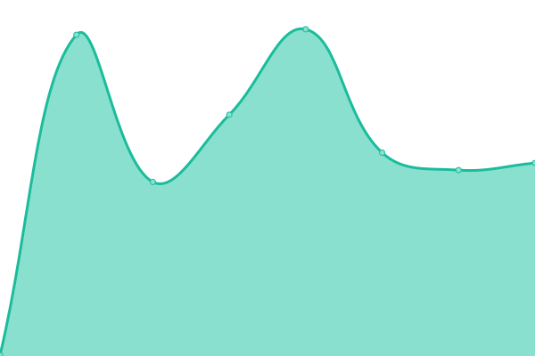
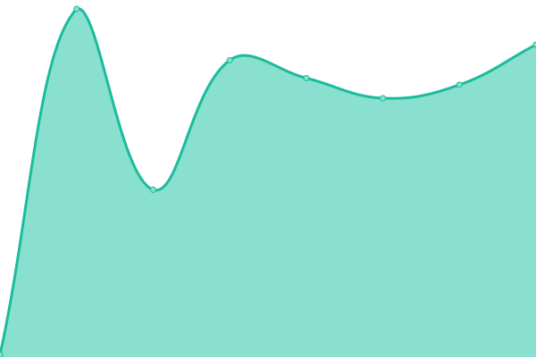
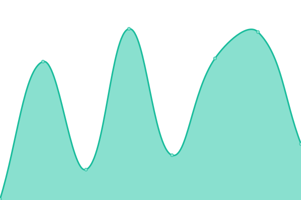
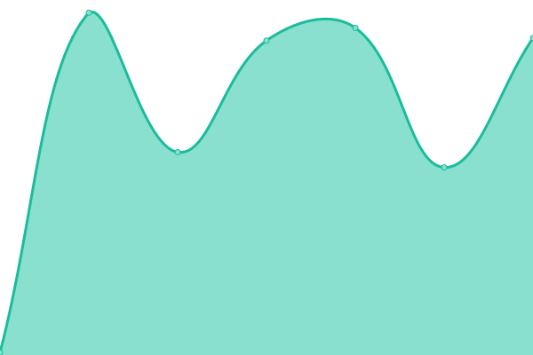
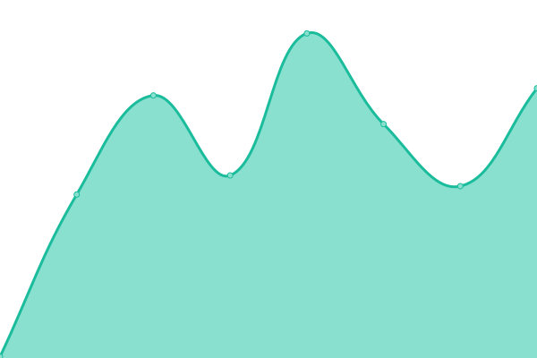

# [📈 Live Status](https://status.bentleyhensel.com): <!--live status--> **🟥 Complete outage**

This repository contains the open-source uptime monitor and status page for [Upptime](https://upptime.js.org), powered by [Upptime](https://github.com/upptime/upptime).

With [Upptime](https://upptime.js.org), you can get your own unlimited and free uptime monitor and status page, powered entirely by a GitHub repository. We use [Issues](https://github.com/upptime/upptime/issues) as incident reports, [Actions](https://github.com/theboatymcboatface/upptime/actions) as uptime monitors, and [Pages](https://status.bentleyhensel.com) for the status page.

<!--start: status pages-->
<!-- This summary is generated by Upptime (https://github.com/upptime/upptime) -->
<!-- Do not edit this manually, your changes will be overwritten -->
<!-- prettier-ignore -->
| URL | Status | History | Response Time | Uptime |
| --- | ------ | ------- | ------------- | ------ |
|  [BentleyHensel.com](https://bentleyhensel.com/) | 🟥 Down | [bentley-hensel-com.yml](https://github.com/TheBoatyMcBoatFace/upptime/commits/HEAD/history/bentley-hensel-com.yml) | 

 166ms
     
 | 

<a href="https://theboatymcboatface.github.io/upptime/history/bentley-hensel-com">0.00%</a>
    

|  [AdminyMcAdminFace](https//portainer.beltway-buzz.com) | 🟥 Down | [adminy-mc-admin-face.yml](https://github.com/TheBoatyMcBoatFace/upptime/commits/HEAD/history/adminy-mc-admin-face.yml) | 

 0ms
     
 | 

<a href="https://theboatymcboatface.github.io/upptime/history/adminy-mc-admin-face">100.00%</a>
    

|  [Beltway Buzzy](https://media.beltway-buzz.com) | 🟥 Down | [beltway-buzzy.yml](https://github.com/TheBoatyMcBoatFace/upptime/commits/HEAD/history/beltway-buzzy.yml) | 

 150ms
     
 | 

<a href="https://theboatymcboatface.github.io/upptime/history/beltway-buzzy">0.00%</a>
    

|  [Ashley & Abby](https://ashleyabby.info) | 🟥 Down | [ashley-and-abby.yml](https://github.com/TheBoatyMcBoatFace/upptime/commits/HEAD/history/ashley-and-abby.yml) | 

 0ms
     
 | 

<a href="https://theboatymcboatface.github.io/upptime/history/ashley-and-abby">0.00%</a>
    

|  [Magic](https://magic.bfhensel.com) | 🟥 Down | [magic.yml](https://github.com/TheBoatyMcBoatFace/upptime/commits/HEAD/history/magic.yml) | 

 144ms
     
 | 

<a href="https://theboatymcboatface.github.io/upptime/history/magic">0.00%</a>
    

|  [A11yWatch Frontend](https://a11ywatch-frontend.public-sector-a11y.app.civicactions.net/) | 🟥 Down | [a11y-watch-frontend.yml](https://github.com/TheBoatyMcBoatFace/upptime/commits/HEAD/history/a11y-watch-frontend.yml) | 

 0ms
     
 | 

<a href="https://theboatymcboatface.github.io/upptime/history/a11y-watch-frontend">0.00%</a>
    

|  [A11yWatch Backend](https://a11ywatch-backend.public-sector-a11y.app.civicactions.net/api/user) | 🟥 Down | [a11y-watch-backend.yml](https://github.com/TheBoatyMcBoatFace/upptime/commits/HEAD/history/a11y-watch-backend.yml) | 

 0ms
     
 | 

<a href="https://theboatymcboatface.github.io/upptime/history/a11y-watch-backend">0.00%</a>
    

<!--end: status pages-->

[**Visit our status website →**](https://status.bentleyhensel.com)

## 📄 License

- Powered by: [Upptime](https://github.com/upptime/upptime)
- Code: [MIT](./LICENSE) © [Upptime](https://upptime.js.org)
- Data in the `./history` directory: [Open Database License](https://opendatacommons.org/licenses/odbl/1-0/)
